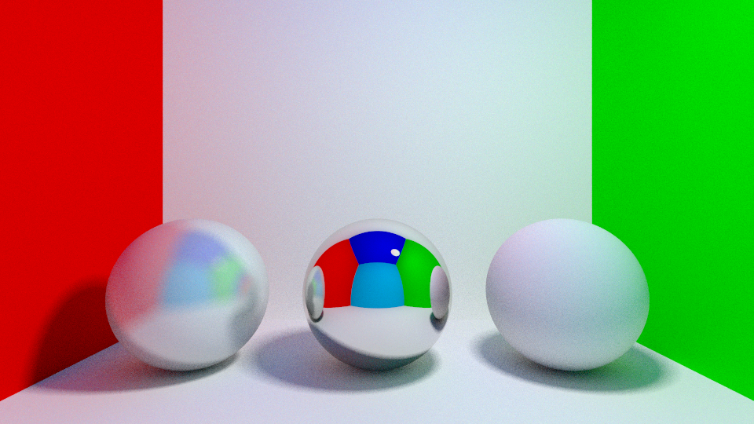

== License ==

Copyright 2017 Forrest Briggs

Permission is hereby granted, free of charge, to any person obtaining a copy of this software and associated documentation files (the "Software"), to deal in the Software without restriction, including without limitation the rights to use, copy, modify, merge, publish, distribute, sublicense, and/or sell copies of the Software, and to permit persons to whom the Software is furnished to do so, subject to the following conditions:

The above copyright notice and this permission notice shall be included in all copies or substantial portions of the Software.

THE SOFTWARE IS PROVIDED "AS IS", WITHOUT WARRANTY OF ANY KIND, EXPRESS OR IMPLIED, INCLUDING BUT NOT LIMITED TO THE WARRANTIES OF MERCHANTABILITY, FITNESS FOR A PARTICULAR PURPOSE AND NONINFRINGEMENT. IN NO EVENT SHALL THE AUTHORS OR COPYRIGHT HOLDERS BE LIABLE FOR ANY CLAIM, DAMAGES OR OTHER LIABILITY, WHETHER IN AN ACTION OF CONTRACT, TORT OR OTHERWISE, ARISING FROM, OUT OF OR IN CONNECTION WITH THE SOFTWARE OR THE USE OR OTHER DEALINGS IN THE SOFTWARE.

I am providing code in this repository to you under an open source license. Because this is my personal repository, the license you receive to my code is from me, and not from my employer (Facebook).

== About: De-noising path tracing using machine learning without covariate-shift ==

Path-tracing is an algorithm for physically realistic 3D rendering. This code implements a basic path tracer which supports spheres and some simple materials. There is nothing fancy or novel about the path tracer; it might even be buggy.

Path-tracing works by simulating how photons are emitted from a light source, then bounce around potentially several times before reaching the camera. The emission and multiple bounces are what give rise to photo-realistic effects like soft shadows, or color bleed. Unfortunately, path-tracing is slow because one must simulate a lot of photons in order to get a good result. If there are not enough photons, the resulting image is noisy (just like the image captured by a real camera in a low-light scenario). One approach to improve results from path tracing while keeping runtime manageable is to apply a de-noising algorithm as a post-processing effect.

A common method for de-noising path tracing using machine learning is to get a large collection of images, then add noise, then learn a model which maps patches of the noisy corrupted image to the same patch of the original, less noisy image. Then the learned model can be applied to a noisy image produced by path tracing with a smaller number of photons. The main problem with this approach is that the distribution of training data will not necessarily match the distribution of test data, resulting in unsatisfactory results / artifacts. Mismatch between training and test distributions is called "covariate-shift" in machine learning literature.

In this sample code, I show how to do de-noising for path tracing using machine learning, without covariate shift! This is a novel algorithm as far as I know. The idea is this:
(1) first render the image using a relatively small number of photons per pixel, e.g., 100.

(2) for some small fraction of pixels chosen at random (e.g., 1%) render only that pixel using a larger number of photons (e.g., 2000). Suppose there are N pixels to be rendered. We spent 100*N photos in pass (1), then 0.01 * 2000 * N = 20N more photons in pass (2). So in total, we have only spent 120 * N photons, a mere 20% more than we did in pass (1).

(3) Train a machine learning model such as a decision tree ensemble to map a small patch of pixels in the noisy image from pass (1) to the better pixel at the center of the same patch obtained in pass (2), using only the pixels where we spent the larger number of photons as training examples. Note that these training examples come from exactly the same distribution as the rest of the image, so there is no problem with covariate-shift!

(4) Apply the learned model to all of the pixels in the noisy image to get a less noisy image.

This algorithm works surprisingly well (see results below). In order for it to be a win in quality, the number of photons per pixel in phase (2) must be sufficient to produce a low-noise result, and the fraction of pixels at which we sample a larger number of photons must also be large enough to obtain sufficient training data (1% works in this simple test scene, but more might be needed for more complex scenes).

But wait... wouldn't it be faster just to shoot more photons with the path tracer instead of training a machine learning model, then applying it at every pixel? If we were training a neural net, then yes, that would probably be true. However, I am also providing a super-fast implementation of Random Forest (an ensemble of decision trees which does not over-fit), which actually trains and predicts in less time than it takes to render the image with 2000 photons per pixel! Random Forest is already a very fast algorithm, but as an experiment/hack to make it even faster, this version stores the binary trees in a binary heap instead of using pointers (I haven't tested if this is actually faster for depth 15+ trees, but it seems reasonable that it would be for depth <= 8).

== Compile and Run ==

cmake -DCMAKE_BUILD_TYPE=Release .
make
./Raytracer2017

== Results ==

Before de-noising (23.0174 sec):

After de-noising (3.18205 sec training + 0.699575 sec to apply):

